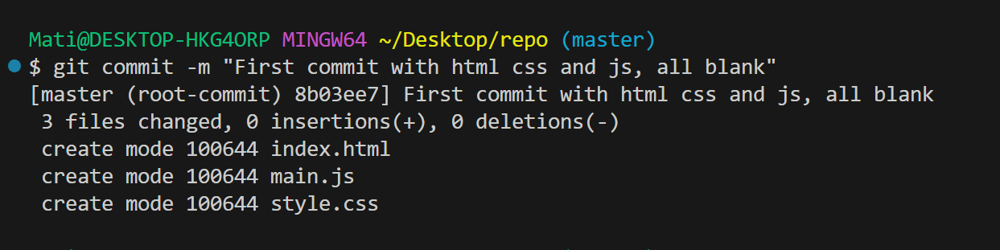

# Documentacion de la creacion de un repositorio
1. He creado los archivos correspondientes en visual studio.
   

2. Con el git add . se han añadido todos los documentos al commit.
   

3. Despues con el commit -m "" he añadido el commit con un mensaje, pero solo en local.
   

4. He creado el repositorio en GitHub y lo he linkeado al local con git remote add origin https://github.com/enricbesora/repo.git.
   

5. He accedido a la rama main del repositorio remoto con branch -M y he hecho el push de mi commit en local con el push -u origin main.
    

6. Ahora mismo tenemos el status del git como que nos falta añadir al commit las fotos que se estan poniendo en este readme y el readme en si.
    

7. Ahora haremos el git add. para añadir todo, despues un commit en el main y finalmente comprovaremos que esta todo correcto dentro de github.
    
    